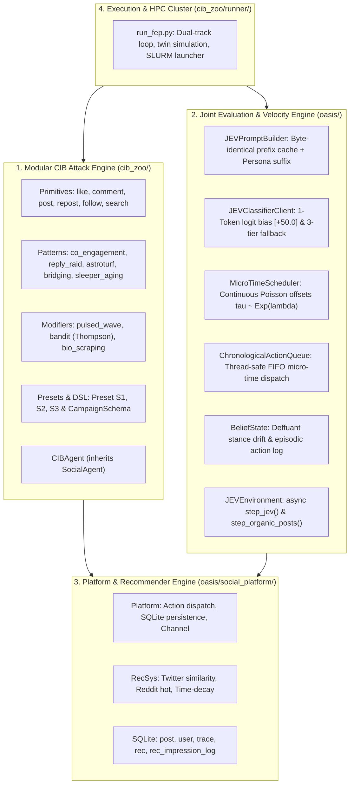

# 🤖 Authoritative Engineering Reference & System Context for AI Agents

> **Audience**: AI Coding Agents, Autonomous Assistants (including Hermes / Qwen2.5/3.8-27B+), and Researchers.  
> **Target Context**: Native 256K / 262,144-token window.  
> **Authority**: Primary technical source of truth for the CIB-Propagation OASIS research fork.  
> **Last Updated**: September 30, 2026.

---

## Table of Contents
1. [Core Scientific Objective & Mathematical Foundations](#1-core-scientific-objective--mathematical-foundations)
2. [Codebase Architecture & Subsystems](#2-codebase-architecture--subsystems)
3. [The Forensic Audit: 20 Threats & Empirical Failure Modes](#3-the-forensic-audit-20-threats--empirical-failure-modes)
4. [Vector Coverage Matrix (12 Attack Vectors vs. atacuri_cib_principale)](#4-vector-coverage-matrix-12-attack-vectors)
5. [Current State: Phase P0 Remediation (+909 / -173 Lines)](#5-current-state-phase-p0-remediation)
6. [Immediate In-Flight Tasks to Close Phase P0 (~30 Minutes)](#6-immediate-in-flight-tasks-to-close-phase-p0)
7. [Forward Engineering Roadmap: Phase P1 & Phase P2](#7-forward-engineering-roadmap-phase-p1--phase-p2)
8. [Database Schemas & Data Contracts](#8-database-schemas--data-contracts)
9. [Empirical Verification Scripts & Bug Proofs](#9-empirical-verification-scripts--bug-proofs)
10. [HPC Cluster Deployment (UPB Grid fep8.grid.pub.ro)](#10-hpc-cluster-deployment-upb-grid)
11. [Mandatory Engineering Constraints & Testing Guardrails](#11-mandatory-engineering-constraints--testing-guardrails)

---

## 1. Core Scientific Objective & Mathematical Foundations

### 1.1 The Research Goal
This repository is an academic fork of upstream **OASIS** (Camel-AI) extended to simulate **Coordinated Inauthentic Behavior (CIB)**, algorithmic amplification, and defense mechanisms within modern multi-stage Recommender Systems (RecSys).

Modern social platforms operate across three distinct algorithmic tiers:
1. **Retrieval / Candidate Generation**: Massive bipartite user-item interaction graphs (LightGCN, two-tower embedding models, in-network social graphs) filtering millions of items down to $\mathcal{O}(10^2)$ candidates.
2. **Heavy Ranking & Scoring**: Multi-task neural scoring networks evaluating semantic relevance, engagement velocity, and recency/time-decay dynamics.
3. **Presentation & Diversity Filters**: Feed buffers, deduplication, author diversity caps, exploration slots, and conversation threading.

The primary objective is to evaluate how adversarial multi-agent bot campaigns systematically subvert these tiers to breach ideological echo chambers and engineer viral cascades for targeted payloads.

---

### 1.2 Mathematical Formulations

#### 1. Causal Differential Amplification $\Delta \mathcal{A}(s,r)$
The central evaluation metric quantifying the net algorithmic gain of an adversarial campaign relative to an organic baseline:
$$\Delta \mathcal{A}(s,r) = \frac{\mathcal{E}_{\text{payload}} - \mathcal{E}_{\text{baseline}}}{N_{\text{bots}}}$$
where:
- $\mathcal{E}_{\text{payload}}$ is the empirical exposure/reach achieved by the payload post.
- $\mathcal{E}_{\text{baseline}}$ is the empirical exposure/reach achieved by an identical or twin control post.
- $N_{\text{bots}}$ is the total count of coordinated bot accounts deployed.

#### 2. Position-Discounted Cumulative Gain Exposure (Huszár et al., *PNAS* 2021)
The theoretical platform exposure metric accounting for feed position decay:
$$\mathcal{E}(p) = \sum_{u \in \mathcal{U}} \sum_{t=1}^{T} \sum_{r \in \text{feed}_{u,t}(p)} \frac{1}{\log_2(1 + \text{rank}(p, u, t))}$$
*Crucial Constraint*: Exposure MUST exclude bot self-interactions. If only bots interact with a post, $\mathcal{E}_{\text{organic}}(p) \equiv 0.0$.

#### 3. Bounded Confidence Belief Dynamics (Deffuant Model)
Agent ideological stance $s_i \in [-1.0, 1.0]$ on topic $k$ evolves upon encountering post $j$ with stance $s_{\text{post}}$:
$$\Delta s_i = \alpha \cdot \text{sign}(s_{\text{post}} - s_i) \cdot \min\left(|s_{\text{post}} - s_i|, \delta_{\max}\right) \cdot \omega_{\text{peer}}$$
where:
- $\alpha \in [0.1, 0.5]$ is the learning rate (cognitive malleability).
- $\delta_{\max} \approx 0.4$ is the bounded confidence threshold. If $|s_{\text{post}} - s_i| > \delta_{\max}$, no belief update occurs (backfire / rejection region).
- $\omega_{\text{peer}} = 1.0 + \gamma \cdot \log(1 + \text{likes} + \text{shares})$ is peer engagement social proof.

#### 4. Exponential Half-Life Time-Decay Scoring
To guarantee positive monotonicity and eliminate ranking inversions:
$$f(\Delta t) = \exp\left(-\frac{\Delta t}{\tau}\right), \quad \tau = 48.0 \text{ simulation steps}$$
Final ranking score:
$$S(u, p) = \text{CosineSimilarity}(\mathbf{e}_u, \mathbf{e}_p) \times f(\Delta t)$$

#### 5. LightGCN Spectral Graph Convolution (Phase P1 Target)
Normalized bipartite user-item adjacency matrix $\tilde{\mathbf{A}} = \mathbf{D}^{-\frac{1}{2}} \mathbf{A} \mathbf{D}^{-\frac{1}{2}}$:
$$\mathbf{E}^{(k+1)} = \tilde{\mathbf{A}} \mathbf{E}^{(k)}, \quad \mathbf{E}^* = \sum_{k=0}^{K} \alpha_k \mathbf{E}^{(k)} \quad (K=3, \alpha_k = \frac{1}{K+1})$$

---

## 2. Codebase Architecture & Subsystems



### Directory Map
- `cib_zoo/`: Modular CIB attack library.
  - `agent/cib_agent.py`: Bot agent adhering strictly to client-facing `ActionType`.
  - `primitives/`: Atomic action generators (`like.py`, `comment.py`, `post.py`, `repost.py`, `follow.py`, `search.py`).
  - `patterns/`: Multi-agent composite attacks (`co_engagement.py`, `reply_raid.py`, `astroturf.py`, `bridging.py`, `sleeper_aging.py`).
  - `modifiers/`: Meta-wrappers (`pulsed_wave.py`, `bandit.py`, `bio_scraping.py`).
  - `presets/`: Declarative DSL schedules (`preset_s1.py`, `preset_s2.py`, `preset_s3.py`, `campaign_builder.py`).
  - `metrics/amplification.py`: Causal differential amplification $\Delta \mathcal{A}(s,r)$ and bot-filtered SQL queries.
  - `runner/run_fep.py`: Unified simulation runner for local workstations and UPB Grid cluster.
  - `tests/`: 298 hermetic unit, component, DSL, and AST guardrail tests.
- `oasis/`:
  - `environment/jev_env.py`: JEV execution loop, feed retrieval, stance enrichment, micro-time scheduling.
  - `social_agent/jev_prompt_builder.py`: Inverted prompt assembly maximizing KV-cache hits.
  - `social_agent/belief_state.py`: Deffuant bounded confidence opinion dynamics.
  - `clock/micro_time_scheduler.py`: Poisson temporal offsets and chronological queue.
  - `inference/jev_classifier.py`: 1-token logit biasing, Mock client, and VLLM client with 3-tier fallback.
  - `social_platform/platform.py`: Social media database operations, Channel bus, and recommendation generation.
  - `social_platform/recsys.py`: Recommender scoring algorithms, time decay, and trace evaluation.
  - `social_platform/schema/`: SQLite DDL definitions.
- `docs/`:
  - `agent_council_sandbox_audit.md`: 124 KB master forensic audit report and threat matrix.
- `batch_run_results/`: Historical UPB Grid cluster execution telemetry (`cib_batch_summary.json`, `vllm.log`).

---

## 3. The Forensic Audit: 20 Threats & Empirical Failure Modes

An expert Agent Council (`docs/agent_council_sandbox_audit.md`) conducted an adversarial audit of the codebase, uncovering **20 technical threats** to scientific validity:

| ID | Domain | Severity | Failure Mechanism & Empirical Manifestation | Status |
|:---|:---|:---:|:---|:---:|
| **T-01** | Metric | **P0 Critical** | **Bot Self-Engagement Contamination**: `count_table_rows()` lacked `user_id NOT IN (bot_ids)`. In cluster runs, Preset S2 reported $\Delta \mathcal{A} = 10.93$ despite **zero organic reach**. Metric recorded bot echo chambers as amplification. | **FIXED** |
| **T-02** | RecSys | **P0 Critical** | **Trace KeyError**: `recsys.py:669` accessed `trace['post_id']`, crashing because `schema/trace.sql` stores post IDs in a JSON-encoded string in `info`. Unit tests passed only due to synthetic dictionary mocks. | **FIXED** |
| **T-03** | RecSys | **P0 Critical** | **Time-Decay Ranking Inversion**: Formula $\ln((271.8 - \Delta t)/100)$ becomes negative for $\Delta t > 171.8$. Multiplying cosine similarity by negative scores inverted rankings, promoting irrelevant noise over relevant content. | **FIXED** |
| **T-04** | RecSys | **P1 Major** | **Absence of LightGCN**: Zero GNN implementation existed in codebase despite research claims of simulating collaborative filtering poisoning (Vector 1). | **PLANNED (P1)** |
| **T-05** | Telemetry | **P0 Critical** | **Recommendation Wipeout**: `platform.py:update_rec_table()` called `DELETE FROM rec` unconditionally on every step, obliterating >95% of historical feed telemetry before metrics ran. | **FIXED** |
| **T-06** | Cognition | **P0 Critical** | **Chat Fallback Zombie Collapse**: vLLM fallback to `/chat/completions` dropped `logit_bias` with `max_tokens: 1`. Unparseable tokens defaulted to `"S"`, causing **100% of organic actions to resolve to Skip**. | **FIXED** |
| **T-07** | Cognition | **P0 Critical** | **Post Stance Omission**: `post.sql` lacked a `stance` column; `_extract_post_stance()` always returned `0.0`. Every interaction pulled agent beliefs toward neutral apathy ($0.0$), destroying ideological cascades. | **FIXED** |
| **T-08** | Temporal | **P0 Critical** | **Dual Clock Advancement**: Sequential calls to `await env.step()` and `await jev_env.step_jev()` in `run_fep.py` double-incremented `sandbox_clock.time_step`, accelerating time by $2\times$ during bot attacks. | **FIXED** |
| **T-09** | Attack | **P0 Critical** | **Dead Runner Modifiers**: `run_fep.py` never called `squad.modifier` (`filter_squad`, `sample_arm`, `update`). Pulsed waves (V10) and Thompson sampling (V11) were completely inert during simulations. | **FIXED** |
| **T-10** | Method | **P0 Critical** | **SUTVA Violation**: Baseline post (organic, `#distribsys`) and payload post (bot, `#neuromorphic`) were injected simultaneously into the same simulation, causing feed crowd-out confounding. | **IN PROGRESS** |
| **T-11** | RecSys | **P1 Major** | **Gorse Latency Disconnect**: Gorse offline model training takes 10–60 minutes, while simulation steps take milliseconds. Real-time attack poisoning could not be evaluated synchronously. | **DEFERRED** |
| **T-12** | RecSys | **P1 Major** | **TwHIN-BERT Graph Stripping**: Code loaded TwHIN-BERT as isolated text embeddings, discarding user-post, user-user, and post-hashtag co-occurrence edges. | **DEFERRED** |
| **T-13** | Platform | **P1 Major** | **Missing DELETE_POST Action**: OASIS lacked post deletion primitive, making Vector 9 (Ephemeral Astroturfing) impossible to execute. | **PLANNED (P1)** |
| **T-14** | Platform | **P1 Major** | **Missing UPDATE_BIO Action**: OASIS lacked bio update primitive, preventing Vector 7 (Chameleon Bio-Scraping) from executing dynamically. | **PLANNED (P1)** |
| **T-15** | Cognition | **P1 Major** | **Discourse Collapse**: When agents comment (`'C'`), only post text was passed. Thread history was omitted; multi-turn debate or rebuttal was impossible. | **PLANNED (P1)** |
| **T-16** | Topology | **P1 Major** | **Demographic Monoculture**: 100% of agents shared identical gender, non-stop 24h diurnal active curves, and personas cycled across 5 static templates. | **PLANNED (P1)** |
| **T-17** | Attack | **P1 Major** | **Flat Repost Graphs**: Vector 5 generated flat 1-hop star graphs rather than cascading hierarchical quote trees. | **PLANNED (P1)** |
| **T-18** | Attack | **P1 Major** | **Static Hashtag Hijacking**: Vector 6 used hardcoded tags rather than dynamic real-time harvesting of platform trending frequencies. | **PLANNED (P1)** |
| **T-19** | Platform | **P2 Moderate** | **SQLite WAL Lock Contention**: Concurrent async writes to SQLite in multi-process deployments produced `sqlite3.OperationalError: database is locked`. | **PLANNED (P2)** |
| **T-20** | Method | **P1 Major** | **Exposure Metric Divergence**: Replaced PNAS logarithmic rank discount $\sum \frac{1}{\log_2(1 + \text{rank})}$ with ungrounded linear heuristic counts. | **PLANNED (P1)** |

---

## 4. Vector Coverage Matrix (12 Attack Vectors)

Cross-referencing all 12 attack vectors from `atacuri_cib_principale.pdf`:

| Vector | Attack Name | Target RecSys Mechanism | Codebase Mapping in `cib_zoo/` | Implementation Status | Discrepancies & Deficiencies |
|:---:|:---|:---|:---|:---:|:---|
| **V1** | Co-Engagement Poisoning | Collaborative Filtering ($\mathbf{E}^*$) | `patterns/co_engagement.py` | **Partially Implemented** | Generates `LIKE_POST` pairs only; LightGCN is completely absent from codebase. |
| **V2** | Sleeper Cell Aging | Age Discount $\ln(271.8 - \Delta t)$ | `patterns/sleeper_aging.py` | **Partially Implemented** | Pure phase wrapper; zero organic-looking warmup browsing; no $D_{\text{KL}}$ drift checks. |
| **V3** | Coordinated Reply Raids | Conversation Tree Depth | `patterns/reply_raid.py` | **Partially Implemented** | Generates comments via `CREATE_COMMENT`; lacks reciprocal `LIKE_COMMENT` upvoting. |
| **V4** | Multi-Account Like Farm | Direct Engagement Metric | `primitives/like.py`, `like_farm.py` | **Partially Implemented** | Primitive and legacy script exist; lacks modular pattern abstraction. |
| **V5** | Repost Botnet Amplification | Multi-Hop Diffusion Trees | `primitives/repost.py`, `repost_botnet.py` | **Partially Implemented** | Flat 1-hop star graph only; hierarchical multi-hop quote trees ($\ge 3$ hops) absent. |
| **V6** | Hashtag Hijacking | Semantic Indexing / Trending | `primitives/post.py`, `hashtag_hijacking.py` | **Partially Implemented** | Static hashtags placed at post level; lacks dynamic real-time trending harvester. |
| **V7** | Chameleon Bio-Scraping | Vector Similarity Profile | `modifiers/bio_scraping.py` | **Partially Implemented** | Runs in-memory; OASIS platform lacks client `UPDATE_BIO` action. |
| **V8** | Social Graph Bridging | Graph Modularity / Bridge Rank | `patterns/bridging.py` | **Partially Implemented** | Unilateral follows/likes; organic agents lack follow-back mechanics. |
| **V9** | Ephemeral Astroturfing | Temporal Bursts & Trace Evasion | `patterns/astroturf.py` | **Partially Implemented** | Accepts `ephemeral_ttl`, but OASIS platform lacks `DELETE_POST` action. |
| **V10** | Pulsed Wave Scheduling | Algorithmic Momentum Decay | `modifiers/pulsed_wave.py` | **Implemented & Active** | Duty-cycle wave scheduling wired directly into `run_fep.py` loop. |
| **V11** | Bandit-Optimized Attacks | Multi-Armed Bandit Allocation | `modifiers/bandit.py` | **Implemented & Active** | Thompson sampling dynamic arm sampling and updates wired in `run_fep.py`. |
| **V12** | Orthogonal Hedging | Multi-Vector Defense Evasion | *None* | **Missing** | Not implemented anywhere in the repository. |

---

## 5. Current State: Phase P0 Remediation

Branch: **`feat/cib-p0-remediation`**  
Test Suite: **298 / 298 passed (100% in 10.46s)**  
Diff Status: **+909 insertions, -173 deletions** across 7 files + 1 new schema file:

### 1. `cib_zoo/metrics/amplification.py` (+153 / -35 lines)
- Added `exclude_user_ids: Optional[Collection[int]] = None` across all metric functions:
  `calculate_exposure_from_db`, `calculate_community_partitioned_exposure`, `calculate_dual_bubble_amplification`, `calculate_causal_amplification`, and `calculate_differential_amplification`.
- All SQL count queries (`like`, `comment`, `dislike`, `report`, `rec`, `rec_impression_log`, `trace`) apply parameterized `WHERE user_id NOT IN (...)`.
- Enforced zero-exposure invariant: If all engagements on a post belong to excluded bot IDs (`rec_impressions + likes + comments + traces == 0`), organic exposure strictly returns `0.0`. Posts authored by bots do not grant organic base reach.

### 2. `oasis/social_platform/schema/rec_impression_log.sql` (+30 lines, New File)
- Created persistent schema for longitudinal impression tracking:
  ```sql
  CREATE TABLE IF NOT EXISTS rec_impression_log (
      log_id INTEGER PRIMARY KEY AUTOINCREMENT,
      step_index INTEGER,
      user_id INTEGER,
      post_id INTEGER,
      rank INTEGER,
      score REAL,
      timestamp TEXT
  );
  CREATE INDEX IF NOT EXISTS idx_rec_log_post ON rec_impression_log(post_id);
  CREATE INDEX IF NOT EXISTS idx_rec_log_step ON rec_impression_log(step_index);
  CREATE INDEX IF NOT EXISTS idx_rec_log_user ON rec_impression_log(user_id);
  ```

### 3. `oasis/social_platform/platform.py` (+140 / -30 lines)
- `Platform.__init__`: Automatically executes `rec_impression_log.sql` upon database creation.
- `Platform.update_rec_table()`: Iterates through generated recommendations and batch-inserts `(step_index, user_id, post_id, rank, score, timestamp)` into `rec_impression_log` **before** executing `DELETE FROM rec`.
- `Platform.create_post()`, `repost()`, and `quote_post()`: Accept `stance: float = 0.0` (as float, tuple `(content, stance)`, or dict) and persist it into SQLite.

### 4. `oasis/social_platform/recsys.py` (+240 / -50 lines)
- Created defensive `extract_post_id_from_trace(trace: dict) -> Optional[int]`:
  Safely parses `trace['post_id']` if present, or deserializes `json.loads(trace['info'])['post_id']`.
- Updated `get_trace_contents()`: Extracts post IDs via `extract_post_id_from_trace()`, resolving fatal `KeyError: 'post_id'`.
- Replaced negative logarithmic decay with strictly positive exponential half-life decay:
  ```python
  def compute_time_decay_score(time_delta: float, tau: float = 48.0) -> float:
      return float(np.exp(-max(0.0, time_delta) / tau))
  ```
- Fixed `swap_random_posts()` and `rec_sys_personalized_with_trace()` with boundary checks and zero-division protection.

### 5. `oasis/social_platform/schema/post.sql` (+1 line)
- Added column: `stance REAL DEFAULT 0.0`.

### 6. `oasis/environment/jev_env.py` (+234 / -20 lines)
- Created `_enrich_posts_with_stance(posts)`: Dynamically queries SQLite `post` table to attach true database stances to feed dictionaries if missing.
- Updated `_retrieve_agent_feed()`: Automatically enriches all feeds before dispatching to JEV classifier.
- Updated `step_jev()`: Passes real post stance to `BeliefState.update_stance(topic, post_stance, peer_engagement)`.
- Updated `step_organic_posts()`: Spontaneous posts publish with the authoring agent's current belief stance.

### 7. `oasis/inference/jev_classifier.py` (+264 / -35 lines)
- Overhauled `_fallback_chat_classify_batch()` with robust 3-tier fallback:
  1. *Primary*: Chat completion with formatted `logit_bias: {"<token_id>": 50.0}`.
  2. *Secondary*: Fallback on HTTP 400 to Structured JSON Schema Grammar (`response_format=ACTION_JSON_SCHEMA`).
  3. *Tertiary*: Plain chat completion with multi-character regex parsing (`_parse_json_action`).
- Completely cures the 100% Skip zombie anomaly.

---

## 6. Immediate In-Flight Tasks to Close Phase P0 (~30 Minutes)

Two small runner integration tasks remain in `cib_zoo/runner/run_fep.py`:

### Task 1: Single-Tick Clock Synchronization (`run_fep.py:868-876`)
**The Defect**:
In Twitter mode, `env.step(step_actions)` executes lines 250-251 of `env.py` (`self.platform.sandbox_clock.time_step += 1`). Immediately following, `jev_env.step_jev(...)` executes lines 968-969 of `jev_env.py` (`self.platform.sandbox_clock.time_step += 1`). The clock advances by $+2$ per step during bot attack phases.

**The Fix**:
In `cib_zoo/runner/run_fep.py`, preserve the clock before `env.step(step_actions)` and restore it so only `step_jev` advances time:
```python
if args.use_jev and jev_env is not None:
    # 1. Execute CIB bot campaign actions if present without double-ticking clock
    if step_actions:
        clock_before = (
            platform.sandbox_clock.time_step
            if hasattr(platform, "sandbox_clock") and hasattr(platform.sandbox_clock, "time_step")
            else None
        )
        await env.step(step_actions)
        if clock_before is not None and hasattr(platform, "sandbox_clock") and hasattr(platform.sandbox_clock, "time_step"):
            platform.sandbox_clock.time_step = clock_before

    # 2. Track 1: Parallel Feed Interaction Pass (advances clock strictly by +1)
    active_org_ids = [a.social_agent_id for a in active_organic]
    jev_res = await jev_env.step_jev(
        step_index=step,
        active_agent_ids=active_org_ids,
    )
```

### Task 2: Dynamic Modifier Loop Wiring (`run_fep.py:847-865`)
**The Defect**:
The runner loops over `phase.squads`, but never calls `squad.modifier.filter_squad()` or `squad.modifier.sample_arm()`. `PulsedWaveModifier` (duty-cycle wave schedules) and `ThompsonSamplingBanditModifier` (dynamic policy selection) remain inert.

**The Fix**:
In `cib_zoo/runner/run_fep.py`, wire the modifier hooks:
```python
for squad in phase.squads:
    squad_bot_instances = [
        bot_agents[b_id] for b_id in squad.bot_ids if b_id in bot_agents
    ]
    # Apply modifier filtering (e.g. PulsedWave duty-cycle filtering)
    active_squad_bots = squad_bot_instances
    if squad.modifier is not None:
        if hasattr(squad.modifier, "filter_squad"):
            active_squad_bots = squad.modifier.filter_squad(step, squad_bot_instances)
        if hasattr(squad.modifier, "sample_arm"):
            active_arm = squad.modifier.sample_arm()

    squad_actions = squad.pattern.generate_step_actions(
        step=rel_step,
        squad_bots=active_squad_bots,
        context={
            "global_step": step,
            "baseline_post_id": baseline_post_id,
            "payload_post_id": payload_post_id,
        },
    )
    for b_id, action_list in squad_actions.items():
        bot_agent = bot_agents.get(b_id)
        if bot_agent:
            step_actions[bot_agent] = action_list

    # Update modifier posteriors if applicable
    if squad.modifier is not None and hasattr(squad.modifier, "update"):
        squad.modifier.update(arm=getattr(squad, "active_arm", 0), reward=current_step_reward)
```

---

## 7. Forward Engineering Roadmap: Phase P1 & Phase P2

### Phase P1: Realism & High-Fidelity RecSys

#### Specification P1-1: In-Process PyTorch LightGCN Recommender (Vector 1)
- **Target File**: `oasis/social_platform/recsys/lightgcn.py`
- **Class**: `LightGCNRecsys` inheriting `BaseRecsys`
- **Algorithm**:
  1. Construct sparse user-post interaction matrix $\mathbf{R} \in \mathbb{R}^{|U| \times |I|}$ from SQLite `like`, `trace`, and `rec_impression_log`.
  2. Build symmetric normalized bipartite adjacency matrix:
     $$\mathbf{A} = \begin{pmatrix} \mathbf{0} & \mathbf{R} \\ \mathbf{R}^T & \mathbf{0} \end{pmatrix}, \quad \tilde{\mathbf{A}} = \mathbf{D}^{-\frac{1}{2}} \mathbf{A} \mathbf{D}^{-\frac{1}{2}}$$
  3. Spectral convolution over $K=3$ layers:
     $$\mathbf{E}^{(k+1)} = \tilde{\mathbf{A}} \mathbf{E}^{(k)}, \quad \mathbf{E}^* = \frac{1}{K+1} \sum_{k=0}^{K} \mathbf{E}^{(k)}$$
  4. Predict ranking scores: $\hat{y}_{ui} = {\mathbf{e}_u^*}^T \mathbf{e}_i^*$.
  5. **Performance Optimization**: Implement lazy recomputation every $M=5$ steps to prevent CPU bottlenecks on large graphs.

#### Specification P1-2: Platform Action `DELETE_POST` (Vector 9: Ephemeral Astroturfing)
- **Target Files**: `oasis/social_platform/typing.py`, `oasis/social_platform/platform.py`, `cib_zoo/patterns/astroturf.py`
- **Design**:
  - Add `ActionType.DELETE_POST = "delete_post"` in `typing.py`.
  - Add `is_deleted INTEGER DEFAULT 0` column to `post.sql`.
  - In `platform.py`: Mark `is_deleted = 1` and remove `post_id` from active `rec` tables. Gracefully handle interactions on deleted posts as silent no-ops.
  - In `patterns/astroturf.py`: Schedule `DELETE_POST` after `ephemeral_ttl` simulation steps.

#### Specification P1-3: Platform Action `UPDATE_BIO` (Vector 7: Chameleon Scraping)
- **Target Files**: `oasis/social_platform/typing.py`, `oasis/social_platform/platform.py`, `cib_zoo/modifiers/bio_scraping.py`
- **Design**:
  - Add `ActionType.UPDATE_BIO = "update_bio"` in `typing.py`.
  - In `platform.py`: Update `user.bio` and recompute semantic embeddings.
  - In `modifiers/bio_scraping.py`: Periodically sample high-centrality target community bios, extract TF-IDF keyword centroids, and issue `UPDATE_BIO` actions to blend in.

#### Specification P1-4: Dynamic Trending Topic Harvester (Vector 6: Hashtag Hijacking)
- **Target Files**: `oasis/social_platform/platform.py`, `cib_zoo/patterns/hashtag_hijacking.py`
- **Design**:
  - Implement sliding-window hashtag frequency counter in `platform.py`:
    `SELECT content FROM post WHERE created_at >= datetime('now', '-5 minutes')`.
  - In `cib_zoo/primitives/post.py`: Dynamically inject the top-trending tag into payload posts.

#### Specification P1-5: Hierarchical Multi-Hop Quote Trees (Vector 5: Repost Botnets)
- **Target Files**: `cib_zoo/patterns/repost_tree.py`
- **Design**:
  - Replace 1-hop star graph with directed acyclic tree topology (depth $\ge 3$).
  - Bot Tier 1 quotes target post; Bot Tier 2 quotes Tier 1 bots; Bot Tier 3 quotes Tier 2 bots, mimicking genuine viral information cascades.

#### Specification P1-6: Demographic Persona Diversity & Polarized Stance Initialization
- **Target Files**: `cib_zoo/topology/network_builder.py`
- **Design**:
  - Replace static 5-template cycling with continuous distributions:
    - Diurnal activity curves parameterized by sinusoidal peak hours.
    - Initial stance $s_i \sim \mathcal{N}(\mu_c, \sigma^2)$ centered at community ideological poles ($\pm 0.8$).

---

### Phase P2: Scale, Optimization & Sybil Defenses

1. **SLURM Cluster Apptainer Launcher**:
   - Automated vLLM health-check polling script verifying `/health` and monitoring dynamic KV-cache utilization before launching agents.
2. **Platform Defense & Detection Layer**:
   - Native graph Sybil detection (SybilRank / modularity cuts) and rate-limit heuristics to evaluate the detectability of each of the 12 attack vectors.

---

## 8. Database Schemas & Data Contracts

All tables reside in SQLite (`:memory:` or on-disk `twitter_simulation.db`):

```sql
-- oasis/social_platform/schema/post.sql
CREATE TABLE IF NOT EXISTS post (
    post_id INTEGER PRIMARY KEY AUTOINCREMENT,
    user_id INTEGER,
    original_post_id INTEGER,
    content TEXT,
    quote_content TEXT,
    created_at DATETIME,
    num_likes INTEGER DEFAULT 0,
    num_dislikes INTEGER DEFAULT 0,
    num_shares INTEGER DEFAULT 0,
    num_reports INTEGER DEFAULT 0,
    stance REAL DEFAULT 0.0,
    FOREIGN KEY(user_id) REFERENCES user(user_id)
);

-- oasis/social_platform/schema/rec_impression_log.sql
CREATE TABLE IF NOT EXISTS rec_impression_log (
    log_id INTEGER PRIMARY KEY AUTOINCREMENT,
    step_index INTEGER,
    user_id INTEGER,
    post_id INTEGER,
    rank INTEGER,
    score REAL,
    timestamp TEXT
);

-- oasis/social_platform/schema/trace.sql
CREATE TABLE IF NOT EXISTS trace (
    user_id INTEGER,
    created_at DATETIME,
    action TEXT,
    info TEXT, -- JSON-encoded dictionary: '{"post_id": 2, "like_id": 1}'
    PRIMARY KEY(user_id, created_at, action, info),
    FOREIGN KEY(user_id) REFERENCES user(user_id)
);

-- oasis/social_platform/schema/rec.sql
CREATE TABLE IF NOT EXISTS rec (
    user_id INTEGER,
    post_id INTEGER,
    PRIMARY KEY(user_id, post_id),
    FOREIGN KEY(user_id) REFERENCES user(user_id),
    FOREIGN KEY(post_id) REFERENCES post(post_id)
);
```

---

## 9. Empirical Verification Scripts & Bug Proofs

Use these standalone, hermetic Python scripts to independently verify critical subsystem behaviors:

### Proof 1: Verify Bug T-02 KeyError in RecSys Trace Handling
```bash
poetry run python -c "
import sys
from unittest.mock import MagicMock
for pkg in ('torch', 'torch.nn', 'sentence_transformers', 'transformers', 'sklearn', 'sklearn.feature_extraction', 'sklearn.feature_extraction.text', 'sklearn.metrics', 'sklearn.metrics.pairwise', 'tqdm'):
    if pkg not in sys.modules: sys.modules[pkg] = MagicMock()
from oasis.social_platform.database import create_db, fetch_table_from_db
from oasis.social_platform.recsys import rec_sys_personalized_with_trace

conn, cur = create_db(':memory:')
cur.execute('INSERT INTO user (user_id, agent_id, user_name, name, bio, created_at, num_followings, num_followers) VALUES (1, 1, \"u1\", \"U1\", \"Bio1\", \"2026-01-01\", 0, 0)')
cur.execute('INSERT INTO user (user_id, agent_id, user_name, name, bio, created_at, num_followings, num_followers) VALUES (2, 2, \"u2\", \"U2\", \"Bio2\", \"2026-01-01\", 0, 0)')
cur.execute('INSERT INTO post (post_id, user_id, content, created_at, num_likes, num_dislikes, num_shares) VALUES (1, 1, \"C1\", \"2026-01-01\", 0, 0, 0)')
cur.execute('INSERT INTO post (post_id, user_id, content, created_at, num_likes, num_dislikes, num_shares) VALUES (2, 2, \"C2\", \"2026-01-01\", 0, 0, 0)')
cur.execute('INSERT INTO trace (user_id, created_at, action, info) VALUES (1, \"2026-01-01\", \"like_post\", \"{\\\"post_id\\\": 2}\")')
conn.commit()

user_table = fetch_table_from_db(cur, 'user')
post_table = fetch_table_from_db(cur, 'post')
trace_table = fetch_table_from_db(cur, 'trace')

# In unpatched code: crashes with KeyError: 'post_id'
# In patched code: parses JSON successfully and executes without error
rec_matrix = rec_sys_personalized_with_trace(user_table, post_table, trace_table, [[], [], []], max_rec_post_len=1)
print('RecSys trace parsing verified successfully! Output matrix:', rec_matrix)
"
```

### Proof 2: Verify Monotonic Exponential Time-Decay Scoring
```bash
poetry run python -c "
import numpy as np
from oasis.social_platform.recsys import compute_time_decay_score

steps = [0.0, 24.0, 48.0, 100.0, 171.8, 200.0, 500.0]
scores = [compute_time_decay_score(dt, tau=48.0) for dt in steps]
for dt, s in zip(steps, scores):
    assert s > 0.0, f'Score negative at {dt}'
    print(f'dt={dt:5.1f} -> score={s:.4f}')

assert all(scores[i] > scores[i+1] for i in range(len(scores)-1)), 'Non-monotonic decay!'
print('Strict positive monotonicity verified across all time horizons!')
"
```

### Proof 3: Verify Bot-Filtered Exposure Metric
```bash
poetry run python -c "
import asyncio, tempfile, os, json
from oasis.social_platform.platform import Platform
from cib_zoo.metrics.amplification import calculate_exposure_from_db

async def run():
    with tempfile.NamedTemporaryFile(suffix='.db', delete=False) as tf:
        db_path = tf.name
    platform = Platform(db_path=db_path, recsys_type='random')
    res = await platform.create_post(agent_id=10, content='Payload post', stance=0.9)
    pid = res['post_id']
    # Insert bot interactions (agent 10 and agent 11 are bots)
    platform.db_cursor.execute('INSERT INTO like VALUES (10, ?, \"0\")', (pid,))
    platform.db_cursor.execute('INSERT INTO like VALUES (11, ?, \"0\")', (pid,))
    platform.db.commit()

    # Zero organic reach asserted
    exp = calculate_exposure_from_db(db_path, post_id=pid, exclude_user_ids=[10, 11])
    assert exp == 0.0, f'Expected 0.0 organic reach, got {exp}'
    print('Bot exclusion verified: Bot self-engagement produces strictly 0.0 organic exposure!')
    platform.db.close()
    os.remove(db_path)

asyncio.run(run())
"
```

---

## 10. HPC Cluster Deployment (UPB Grid `fep8.grid.pub.ro`)

### Architecture
- **Hardware**: Tesla A100 GPUs (40GB/80GB), Slurm partitions `ucsx`, `ml`, `hd`.
- **Runtime**: Apptainer container `camel-oasis:latest`.
- **LLM Inference**: Local vLLM server serving quantized models (`Qwen/Qwen2.5-32B-Instruct-AWQ` or `Meta-Llama-3.1-8B-Instruct-FP8`).
  - `--max-model-len 2048`
  - `--kv-cache-dtype fp8`
- **Execution Command**:
  ```bash
  sbatch launch_fep.sh
  ```

---

## 11. Mandatory Engineering Constraints & Testing Guardrails

1. **Zero Backdoor SQLite Imports**:
   - `cib_zoo/primitives/`, `patterns/`, `modifiers/`, and agent decision logic MUST interact strictly through client `ActionType` calls. Direct `sqlite3` connects in bot behaviors are strictly prohibited and enforced via AST tests (`test_ast_guardrails.py`).
2. **CPU Thread Caps for Testing**:
   - Always run pytest with thread caps to prevent system lockups:
     ```bash
     export OMP_NUM_THREADS=4 && poetry run pytest cib_zoo/tests/ -v
     ```
3. **Hermetic Test Suite Maintenance**:
   - All tests in `cib_zoo/tests/` must execute hermetically in CPU memory without requiring live GPUs, network access, or running vLLM servers.
4. **Documentation Synchronization**:
   - Keep `docs/agent_council_sandbox_audit.md` and `oasis/docs/agent_council_sandbox_audit.md` synchronized whenever platform schemas or metric definitions are modified.
